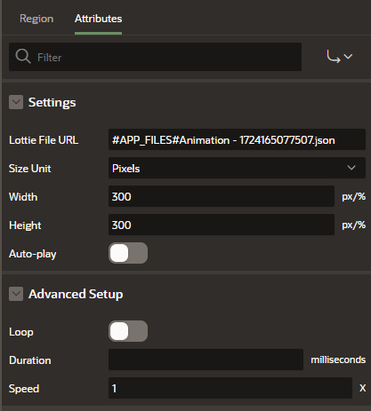
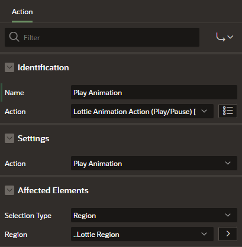

Animations are a great way to enhance the user experience and make applications more engaging. Lottie, an animation file format developed by Airbnb, allows designers to create scalable, high-quality animations that can be easily integrated into web applications. In this tutorial, we'll explore how you can use the APEX Lottie Animation plugins to seamlessly integrate and control these animations within your Oracle APEX applications.


## What is Lottie?

Lottie is a library that renders animations exported as JSON files from Adobe After Effects, using the Bodymovin plugin. These animations are lightweight, scalable, and can be controlled programmatically, making them perfect for modern web and mobile apps. You can find a large collection of Lottie animations on platforms like [LottieFiles](https://lottiefiles.com/).

## Use Case: Enhancing User Experience in Oracle APEX

Imagine you’re building an Oracle APEX application, and you want to make your landing page more visually appealing. By using Lottie animations, you can add dynamic visuals such as loading animations, success icons, or interactive illustrations that bring your application to life.

### Example Scenario:
You’re developing a dashboard in APEX and want to display an animated success icon whenever a data refresh is completed. Using the Lottie Animation plugin, you can easily embed this animation into your APEX page, set it to auto-play, and loop it until the process completes.

## Installing the APEX Lottie Animation Plugins

To get started, you'll need to install the plugins in your Oracle APEX environment. Follow these steps:

1. **Download the Plugin Files**  
   Begin by cloning or downloading the repository containing the plugins from [GitHub](https://github.com/kevintech/apex_lottie_animations).

   ```bash
   git clone https://github.com/kevintech/apex_lottie_animations.git
   ```

2. **Import the Plugins into Oracle APEX**
   - Open your Oracle APEX application and navigate to **Shared Components** > **Plugins**.
   - Click **Import** and upload the SQL files for the plugins:
     - Template Component Plugin
     - Region Plugin
     - Dynamic Action Plugin
   - Follow the prompts to complete the installation.

## Adding Lottie Animations to Your Page

After installing the plugin, adding Lottie animations to your page is easy. Below are the steps to include a Lottie animation using either the Template Component or Region Plugin.

### Step 1: Add the Plugin to Your Page

1. In your APEX app, open the page where you want to add the animation.
2. Click **Add a Region** and select either the **Lottie Animation (Region Plugin)** or choose to insert it as a **Template Component**.
3. Position the region or component where you want the animation to appear.



### Step 2: Configure the Plugin Attributes

1. **Lottie File URL**: Provide the URL of the Lottie JSON file. You can either use a file hosted on LottieFiles or upload your own JSON file to a static workspace and use that link.
2. **Size Unit (pixels, percentage)**: Choose how the width and height should be measured—either fixed (px) or relative (%) for responsive design.
3. **Width and Height**: Set the dimensions based on your size unit.
4. **Auto-play**: Enable auto-play ("y") if you want the animation to start automatically when the page loads.
5. **Loop**: Enable looping ("y") if you want the animation to repeat indefinitely.
6. **Duration**: Specify the total duration of the animation in milliseconds, allowing you to control playback speed.
7. **Speed**: Set the playback speed (e.g., 1x for normal speed, 2x for double speed).

### Step 3: Preview Your Animation

Once configured, save your changes and preview the page. The Lottie animation should now appear according to your settings, enhancing your application with dynamic visual content.

### Step 4: Control Animations with the Dynamic Action Plugin

The Dynamic Action plugin allows you to control the Lottie animations interactively based on user actions.



1. **Add the Dynamic Action Plugin**
   - Navigate to **Dynamic Actions** within the page you’re working on.
   - Create a new dynamic action and select **Lottie Animation Control** from the list.

2. **Configure the Dynamic Action**
   - Set the **Action Type** to determine the control (Play, Pause, Stop).
   - Specify the **Target Animation**—either a Template or Region Plugin instance—to control.

3. **Trigger the Dynamic Action**
   - Set up the event that will trigger the dynamic action, such as a button click, page load, or any other user interaction.

## Conclusion

Integrating and controlling Lottie animations in your Oracle APEX applications is now easier than ever with the APEX Lottie Animation plugins. Whether you want to enhance your app with dynamic visuals or add interactive controls for your animations, these plugins provide the tools you need to make your applications more engaging and user-friendly. Try them out in your next APEX project and see the difference they can make!

## Support

If you need help or have any questions, feel free to reach out via:
- **Email**: [hello@kevintech.ninja](mailto:hello@kevintech.ninja)
- **GitHub Issues**: Open an issue in the [repository](https://github.com/kevintech/apex_lottie_animations).