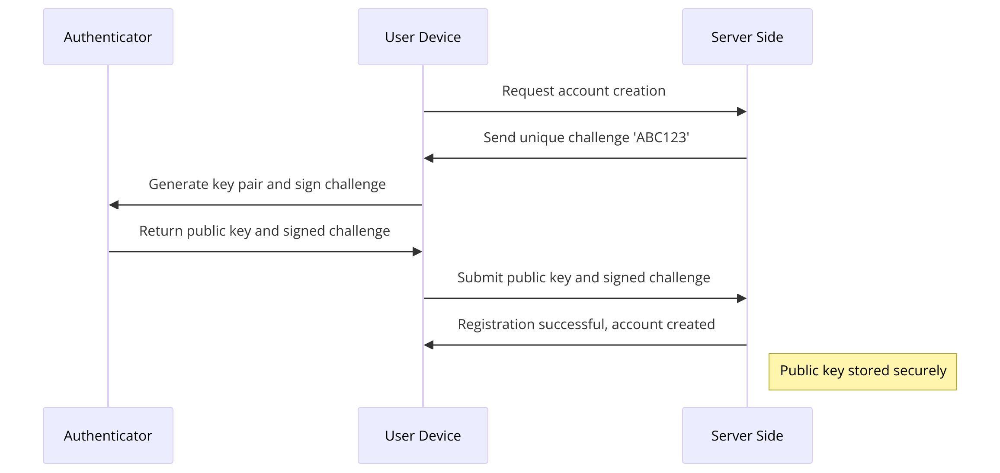
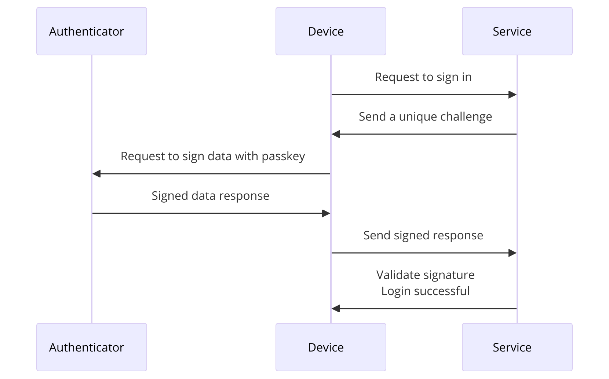
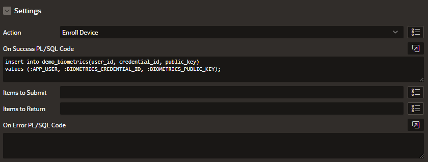
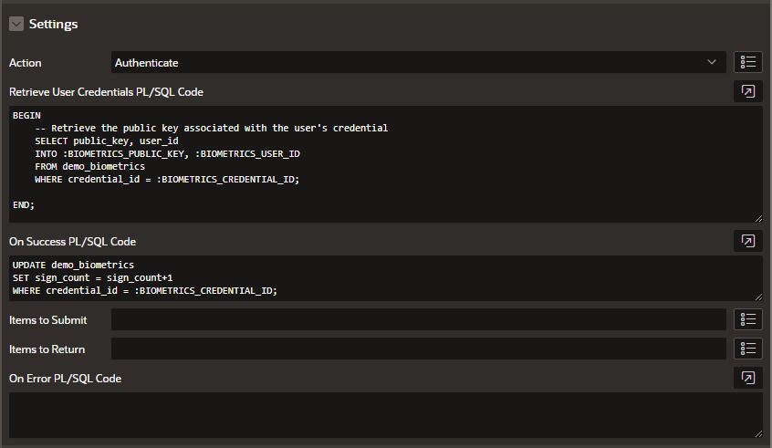

Did you know that 81% of data breaches are caused by weak or stolen passwords? As developers, we've all faced the challenge of securing user authentication while maintaining a smooth user experience. Enter passkeys—the next generation of passwordless authentication built on the WebAuthn standard. This post explains how we implemented passkeys in Oracle APEX and introduces a custom plugin that makes integration seamless for developers.

## Prerequisites

Before diving into implementation, ensure you have:
- Oracle APEX 21.1 or higher
- AS_CRYPTO package version 1.2 or higher
- Modern browsers with WebAuthn support:
  - Chrome 67+
  - Firefox 60+
  - Safari 13+
  - Edge 79+

## What Are Passkeys?

Passkeys represent a revolutionary approach to authentication that eliminates traditional passwords. They leverage public-key cryptography, where private keys are securely stored on the user's device, and public keys are stored in the application's backend. With passkeys, users authenticate with something they are (biometric data) or have (a security key), making passwords obsolete.

### Key Benefits

1. **Enhanced Security**
   - Phishing-resistant by design
   - Immune to credential stuffing attacks
   - No shared secrets to compromise
   - Hardware-backed security on modern devices

2. **Improved User Experience**
   - No passwords to remember or type
   - Login times reduced by up to 70%
   - Consistent experience across devices
   - Native biometric integration

3. **Reduced Operational Costs**
   - 80% fewer support tickets related to authentication
   - Eliminated password reset workflows
   - Lower security incident response costs
   - Simplified compliance requirements

4. **Enterprise-Ready**
   - FIDO Alliance certified
   - Built on proven WebAuthn standards
   - Cross-platform compatibility
   - Seamless integration with existing systems

## How Passkeys Work

1. **Registration Flow**
   - User initiates registration
   - Server generates challenge
   - Device creates key pair
   - Public key stored on server
   - Private key secured on device


2. **Authentication Flow**
   - User initiates login
   - Server issues challenge
   - Device signs challenge
   - Server verifies signature
   - Access granted upon validation


## Implementing Passkeys in Oracle APEX with AS_CRYPTO

We used the `AS_CRYPTO` package to handle all cryptographic operations for passkey validation, including hashing, signature verification, and public key decoding. Here’s how each major step works:

### Step 1: Setting Up Credential Enrollment
The application must create a challenge and configure the `publicKey` options for `navigator.credentials.create()`. Once a user registers, the public key and credential ID are stored in a secure table.

##### Example Table Schema
```sql
CREATE TABLE biometrics_credentials (
  id NUMBER GENERATED BY DEFAULT ON NULL AS IDENTITY,
  user_id VARCHAR2(255) NOT NULL,
  credential_id VARCHAR2(255) NOT NULL,
  public_key CLOB NOT NULL,
  created_at TIMESTAMP WITH TIME ZONE DEFAULT SYSTIMESTAMP NOT NULL,
  last_used_at TIMESTAMP WITH TIME ZONE
);
```

##### Example Code for Challenge Generation (PL/SQL)
```sql
DECLARE
  l_challenge RAW(32);
BEGIN
  l_challenge := AS_CRYPTO.RANDOMBYTES(32);
  -- Convert to base64url for JSON usage
  DBMS_OUTPUT.PUT_LINE(AS_CRYPTO.ENCODE_BASE64URL(l_challenge));
END;
```

##### Client-Side Code for Enrollment
```javascript
const options = {
  publicKey: {
    challenge: Uint8Array.from(window.atob('YOUR_BASE64_CHALLENGE'), c => c.charCodeAt(0)),
    rp: { 
      name: "Your App Name",
      id: window.location.hostname 
    },
    user: { 
      id: Uint8Array.from("USER_ID", c => c.charCodeAt(0)), 
      name: "username", 
      displayName: "User Display Name" 
    },
    pubKeyCredParams: [
      { type: "public-key", alg: -7 }, // ES256
      { type: "public-key", alg: -257 } // RS256
    ],
    authenticatorSelection: {
      userVerification: "preferred",
      residentKey: "preferred"
    },
    timeout: 60000
  }
};

try {
  const credential = await navigator.credentials.create(options);
  // Send credential to server and securely store the credential ID and public key
  await submitCredentialToServer(credential);
} catch (err) {
  console.error('Enrollment failed:', err);
  // Handle error appropriately
}
```

### Step 2: Authentication Implementation
Authentication requires fetching the stored `public_key` and verifying the signature.

##### Server-Side Signature Validation
```sql
DECLARE
  l_client_data_hash RAW(32);
  l_data_to_verify RAW(32767);
  l_signature RAW(64);
  l_public_key RAW(32767);
  l_verification_result BOOLEAN;
BEGIN
  -- Hash the client data
  l_client_data_hash := AS_CRYPTO.HASH(
    AS_CRYPTO.ENCODE('{"type":"webauthn.get"}'), 
    AS_CRYPTO.HASH_SH256
  );
  
  -- Combine authenticator data and client data hash
  l_data_to_verify := UTL_RAW.CONCAT(
    :authenticator_data, 
    l_client_data_hash
  );

  -- Verify the signature
  l_verification_result := AS_CRYPTO.VERIFY(
    l_data_to_verify, -- expected value (original msg)
    :raw_signature, -- signature
    l_public_key, -- encoded public key
    ,AS_CRYPTO.KEY_TYPE_EC -- key algo
    ,AS_CRYPTO.SIGN_SHA256withECDSAinP1363 -- key algo
  );

  IF NOT l_verification_result THEN
    RAISE_APPLICATION_ERROR(
      -20001, 
      'Signature validation failed.'
    );
  END IF;
END;
```

##### Example Code for Successful Authentication Handler

```sql
-- Example of successful authentication handler
CREATE OR REPLACE PROCEDURE handle_passkey_auth (
  p_credential_id IN RAW,
  p_user_id IN NUMBER
) AS
BEGIN
  -- Verify credential exists and is valid
  SELECT 1 
  FROM biometrics_credentials
  WHERE credential_id = p_credential_id
  AND user_id = p_user_id
  AND created_at > sysdate - 365;  -- Expire after 1 year
  
  -- Set up session state
  APEX_AUTHENTICATION.POST_LOGIN(
    p_username => p_user_id
  );
EXCEPTION
  WHEN NO_DATA_FOUND THEN
    raise_application_error(-20001, 'Invalid credential');
END;
```

---

## The Oracle APEX Passkey Authentication Plugin

Manual implementation requires handling a range of complex operations, from constructing WebAuthn JSON options to securely managing cryptographic processes. The **Oracle APEX Passkey Authentication Plugin** simplifies these tasks:

- **Dynamic Action Configuration**: Easily set up enrollment, authentication, and status checks with built-in dynamic actions.
- **Secure Cryptographic Validation**: Uses `AS_CRYPTO` internally, saving you from implementing signature and key management manually.
- **Rapid Deployment**: Focus on business logic while the plugin handles WebAuthn integration.

### Plugin Features

- One-click enrollment and authentication setup
- Automatic browser capability detection
- Configurable UI elements and messages
- Comprehensive error handling

### Using the Plugin

Follow these steps to use the plugin, referencing the full documentation provided in our README:

#### Prerequisites

1. **Install AS_CRYPTO Package**
   - Download and install `AS_CRYPTO` from the [AS_CRYPTO GitHub repository](https://github.com/antonscheffer/as_crypto)
   - Required for secure cryptographic operations
   - Follow installation instructions in the repository README

#### Step 1: Plugin Installation

1. **Download the Plugin**
   - Get the latest release from the [official repository](https://github.com/viscosityna/apex-biometrics-authentication)
   - Review release notes for version-specific information

2. **Import the Plugin**
   - Navigate to Shared Components → Plugins in your APEX application
   - Import the downloaded plugin file
   - Configure application-level attributes:
     - Dialog titles
     - Custom messages

#### Step 2 (optional): Database Setup

Create the credential storage table with the following structure:

```sql
CREATE TABLE biometrics_credentials (
  id NUMBER GENERATED BY DEFAULT ON NULL AS IDENTITY,
  user_id VARCHAR2(255) NOT NULL,
  credential_id VARCHAR2(255) NOT NULL,
  public_key CLOB NOT NULL,
  created_at TIMESTAMP WITH TIME ZONE DEFAULT SYSTIMESTAMP NOT NULL,
  last_used_at TIMESTAMP WITH TIME ZONE
);
```

#### Step 3: Dynamic Action Setup

After installing the plugin, you'll need to set up the necessary dynamic actions to handle both enrollment and authentication. Here's a detailed guide on configuring each:

##### 1. Enrollment Configuration

This action registers a new passkey credential for a user.


**Configuration Steps:**
1. Create a Dynamic Action on your enrollment button/link
2. Set Action: "Viscosity | Passwordless Authentication [Plug-In]"
3. Set Action Type: "Enroll"
4. Set up the "Success" handler with PL/SQL code to store the credential

**Example Success Handler:**
```sql
-- Store the credential after successful enrollment
insert into biometrics_credentials (
  user_id,
  credential_id,
  public_key
) values (
  :APP_USER,
  :BIOMETRICS_CREDENTIAL_ID,
  :BIOMETRICS_PUBLIC_KEY
);
```

Optionally, you can also set up an "Error" handler to manage enrollment failures according to your application's needs.

##### 2. Authentication Configuration

This action verifies an existing passkey credential.


**Configuration Steps:**
1. Create a Dynamic Action on your login button
2. Set Action: "Viscosity | Passwordless Authentication [Plug-In]"
3. Set Action Type: "Authenticate"
4. Configure the required PL/SQL code:
   
   **Credentials Retrieval:**
   ```sql
   BEGIN
     -- Retrieve stored credential for verification
     select public_key, user_id
     into :BIOMETRICS_PUBLIC_KEY, :BIOMETRICS_USER_ID
     from biometrics_credentials
     where credential_id = :BIOMETRICS_CREDENTIAL_ID;
   END;
   ```

   **Success Handler (Optional):**
   ```sql
   -- Update last used timestamp after successful authentication
   update biometrics_credentials
   set last_used_at = systimestamp
   where credential_id = :BIOMETRICS_CREDENTIAL_ID;
   ```

##### 3. Status Check Configuration (Optional)

This action checks if a user has registered passkeys.

**Configuration Steps:**
1. Create a Dynamic Action on page load
2. Set Action: "Viscosity | Passwordless Authentication [Plug-In]"
3. Set Action Type: "Check Enrollment Status"
4. Configure Settings:
   - Display Button When: "Credentials Found" or "No Credentials"

---

## Troubleshooting Guide: Common Issues and Solutions

1. **Enrollment Failures**
   - Verify browser compatibility
   - Check for existing credentials
   - Ensure proper SSL configuration
   - Validate user permissions

2. **Authentication Errors**
   - Verify credential hasn't expired
   - Check signature algorithm matching
   - Validate challenge response
   - Review server logs for details

3. **Plugin Configuration**
   - Confirm table structure matches
   - Verify PL/SQL parameters
   - Check JavaScript console
   - Review APEX debug logs

## Performance Considerations

Our benchmarks show:
- Average enrollment time: < 2 seconds
- Authentication time: < 1 second
- Database impact: Minimal (< 1kb per credential)
- Network usage: ~60% less than password auth

## Conclusion

Implementing passkeys in Oracle APEX represents a significant step forward in application security and user experience. Our plugin makes this transition seamless, allowing developers to focus on building great applications rather than wrestling with authentication complexity.

The future of authentication is passwordless, and with tools like this, that future is already here. We encourage you to try the plugin, share your feedback, and join us in making the web more secure and user-friendly.

### Additional Resources

- [Plugin Documentation](https://github.com/viscosityna/apex-biometrics-authentication)
- [WebAuthn Specification](https://www.w3.org/TR/webauthn-2/)
- [FIDO Alliance](https://fidoalliance.org/)

### Get Started Today

Download the plugin from our [GitHub repository](https://github.com/viscosityna/apex-biometrics-authentication) and join our community of developers building secure, passwordless applications with Oracle APEX.

This plugin was created by [@kevintech](https://github.com/kevintech) and [@viscosityna](https://github.com/viscosityna), who continue to maintain and improve it based on community feedback.

*Have questions or feedback? Join our discussion forum or open an issue on GitHub.*